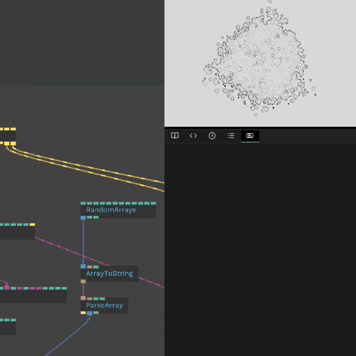
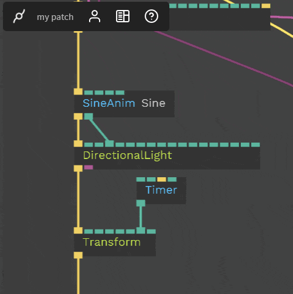
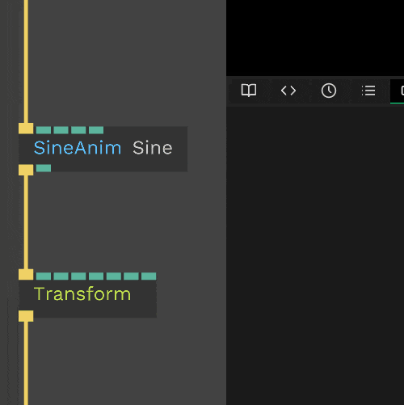
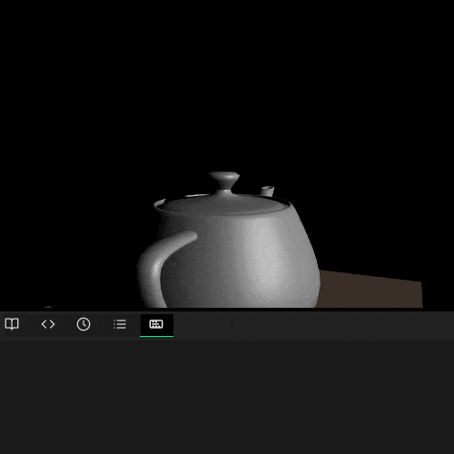
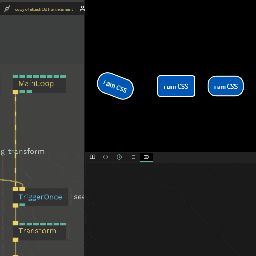
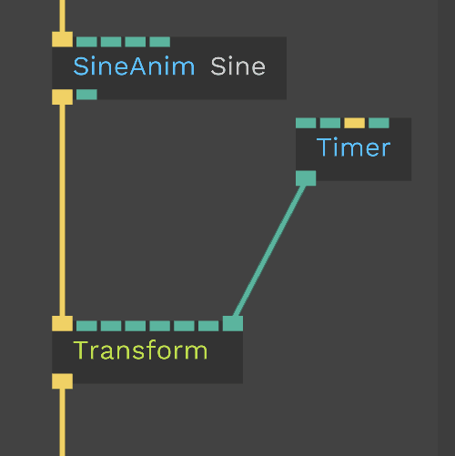
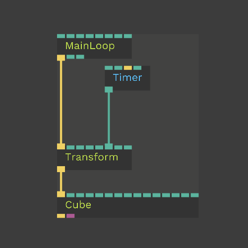
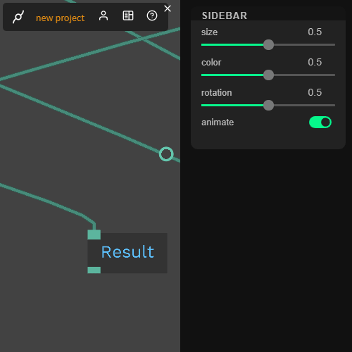
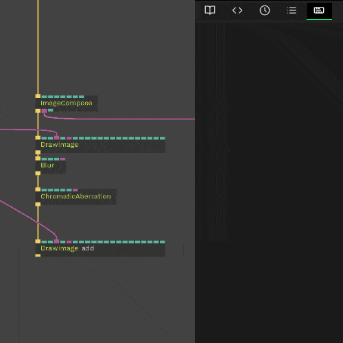

# User Interface Walkthrough

<iframe width="560" height="315" src="https://www.youtube.com/embed/d3jGof4GSCc" frameborder="0" allow="accelerometer; autoplay; encrypted-media; gyroscope; picture-in-picture" allowfullscreen></iframe>

*cables* has a lot of small helpers which make working with *cables* as easy and fast as possible. In this chapter you will get to know the most important keyboard shortcuts, elements and mouse actions.  

To **add an op** press the `Esc`-key. In the popup you can now enter any text which is part of the op’s namespace (e.g. `MainLoop`). You can now navigate through the result-set using your arrow keys (`↓` and `↑`).  

When you press `Enter` the selected op will be added to the editor.     

 
 

To **add another op and connect it** to the one we just added you can now drag out a cable from one of the ports.  

 
 

To **add an op in between two ops** just press the circle in the middle of the cable (one of the existing ops must be highlighted for this).  

 
 

To **change one of the op-parameters** first select the op by clicking on it, then you will see the the op-settings in the pane on the right. To change one of the number value inputs click and drag up or down.

 
 

To **access an op’s example patch** first select the op, then click **view example patches**.

 
 

To **delete a cable** just press the `right mouse button` on one of the connected ports.

 
 

To **reconnect a cable to another port** press and drag with the `right mouse button`.

 
 

**Ops can be duplicated** by making a selection with your `left mouse button`, pressing `cmd + c` or `ctrl + c` to copy, followed by `cmd + v` or `ctrl + v` to paste.  

 
 

To bring some order into your patch you can **align ops** by making a selection with your `left mouse button` and pressing `a` to horizontally align or `shift + a` to vertically align.   

 
 

To **unlink an op** hold it with the `left mouse button` and shake it.  

 
 

You can also unlink ops by selecting them and pressing `x`

 
 

Drag a cable to the center of an op to see suggestions of fitting ports. if there is only one the link will be connected automatically.

 
 

To add an existing op between two other ops, click and drag it to the middle of the cable and release.

 
 

Duplicate a link by pressing `alt` and the `right-mouse button` and dragging the cable to another port

 

See data and function flow by pressing `f`

 
 

Disable ops and its children by pressing `d`

 
 

Temporarily disconnect/bypass a selected op by pressing `shift+d`, pressing `shift+d` again reconnects the cable

 
 

Upload files by **dragging them** into the window

 
 

**access the command palette** by pressing `CMD+P` or `CTRL+P`. 

 
 

set a custom title to an op by clicking the title in the parameter panel (you can also select an op and press `t`)

 
 

organize huge patches by putting ops into subpatches

 
 

to **find documentation and examples** for an op, click on the op and then click the link

 
 

set colors for ops for easier identification

 
 

create and link new op by clicking parameter

 
 

use snap to grid for cleaner looking patches

 
 

`left click` on an output field in any operator's parameter panel to **copy it to your clipboard**. Great for saving arrays or generated outputs.

 
 

Press `CTRL-F` on your keyboard to **Find operators in your project by name or by tag** - for example, unconnected or bookmarked.

 
 

Drag a cable from an operator port directly to a parameter name in a parameter panel of another op.

 
 

`left click` on the patch preview and select the gizmo icon to enable or disable helpers and transforms. Show All transforms will show all moveable objects in your scene, `left click` the circle to enable the object's gizmo.

 
 

To select DIV elements directly from the patch preview, hover over your DIV elements while holding Control on your keyboard and left clicking on the DIV element.

 
 

To **move a cable connection to another port**, hold `SHIFT+ALT` keyboard keys and `right mouse button` while over either end of the cable.

 
 

You can `right click` and drag a cable from a port or the cable itself, to **copy the connection**.

 
 

**Jump to a connected operator** in the parameter panel by `left clicking` its name next to the parameter it is connected to.

 
 

Quickly **find your sidebar operators** in a patch by `left clicking` on a sidebar element while holding the `CTRL` key on your keyboard.

 
 

You can **organize your operators** into colorful Area groups by selecting multiple ops and `left clicking` Create Area. Move operators out of an area to separate them, group groups into groups, hold down `ALT` to drag Area without ops!

