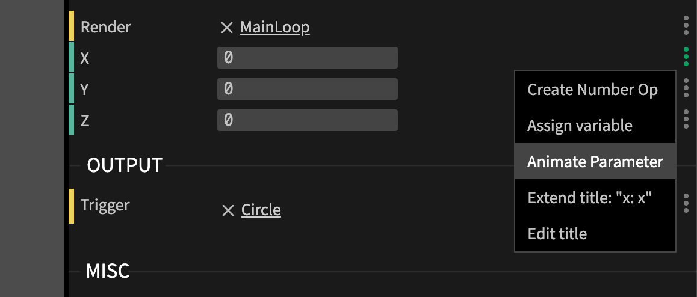
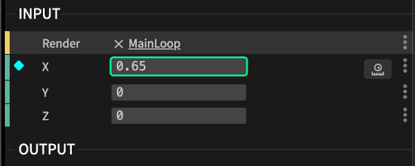
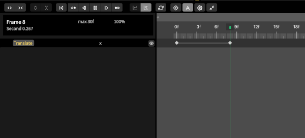

# Timeline Keyframe Animation

We’ve completely rebuilt the Timeline — bringing true keyframing to your patches so you can animate any parameter with precision, from subtle color fades to complex camera moves.
Designed for both developers and motion designers, this is your space to shape motion — set keyframes, curve your easing, and see every change happen in real time.
Rewritten from the ground up with a cleaner interface, better performance and smoother workflow, the Timeline gives you the precision of a professional animation tool, right inside your browser.

[more about the timeline on the cables blog](https://blog.cables.gl/animations/)

## youtube tutorials

<iframe width="640" height="360"  src="https://www.youtube.com/embed/videoseries?list=PLYimpE2xWgBuqFaTsnD-tmtUUHQu3z82h&showinfo=1" frameborder="0" allowfullscreen></iframe>

## Create your first animation

1. Choose a port/input parameter that you want to animate.
2. Click the three dot menu next to the port

    

3. Open the timeline by clicking the icon that just appeared

    

4. Open the timeline by clicking the icon that just appeared

5. Move the cursor by dragging the mouse cursor over the timing ruler line and adjust the value of the parameter. You now created a new key at this point in time!

    
