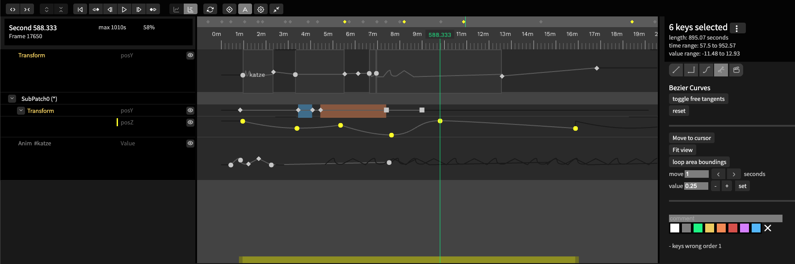

# Keyframe Animation

The new Cables timeline offers a powerful, modular environment for keyframe animation, procedural motion, and precise control over object parameters. Below is a guide to its primary features and typical workflow.

***

### 1. Animation Types in Cables

- **Procedural Animation**
Trigger motion using timer-based or mathematical operations (e.g., `MapRange`), ideal for continuous effects or automated behaviors.
- **Keyframe Animation**
Place and edit specific parameter values at chosen points in time for total control over transitions and timing.

***

### 2. Getting Started: Animating a Circle

**Step-by-Step:**

1. **Create a Circle**: Insert a circle object and apply a Transform operator.
2. **Open Parameter Animation**: In the Inspector Panel, locate the parameter (e.g., `posY`).
3. **Enable Keyframe Animation**: Click the three dots next to the parameter and choose “Animate Parameter.”
4. **Access Timeline**: A timeline icon appears; click it to open the timeline view.
5. **Add Keyframes**:
    - Move the playhead to the desired time.
    - Adjust the parameter’s value; a new keyframe is added.
6. **Repeat** for other parameters (e.g., `posX`) to animate multiple tracks.

***

### 3. Timeline Interface Breakdown

#### Controls (Top Bar)

- Rewind, fast-forward, and jump between keyframes.
- Use keyboard shortcuts “J” and “K” for quick navigation.
- Toggle between time (seconds) and frames; default snapping is set to 30 FPS.

#### Track Area (Left)

- Shows all animated parameters.
- Mute animations with the mute icon for selective playback.

#### Timeline Overview (Middle)

- Zoom and pan to navigate the timeline using the mouse wheel and drag.
- Green playhead shows current time.
- Drag keyframes to move or stretch for timing adjustments.
- Group move multiple selected keys with the yellow highlight area.

#### Detail Panel (Right)

- Displays track statistics: key count, duration, value range.
- Loop mode, interpolation, and buttons for fit-to-view or spreadsheet key editing.

***

### 4. Key Interactions \& Editing

- **Insert Key**: Double-click a track or use the “add key” icon.
- **Disable Auto-Key**: Click the “A” (auto) icon to try out values without saving keys.
- **Copy \& Paste**: Use Cmd+C to copy and Cmd+V to paste keys.
- **Group Edit**: Select multiple keys to move or stretch them together.

**Tips:**

- Add comments and color to keys for clear timeline annotations.
- Use mute for isolating tracks during animation preview.

***

### 5. Viewing \& Adjusting Animation

- **List (Track) View**: Displays discrete key markers.
- **Graph View**: Visualizes value curves over time.
    - The Y-axis represents values; the X-axis is time.
    - Adjust curve tangents in Bezier mode for smooth motion transitions.

***

### 6. Interpolation Modes

| Interpolation Type | Description |
| :-- | :-- |
| Linear | Straight lines, constant rate between keyframes |
| Absolute | Instant jumps, no in-between values |
| Predefined Curves | Built-in ease in/out options for natural motion |
| Bezier | Custom tangents for detailed curve control |
| Clip | References a reusable animation section (Clip) |

Change mode with the icons above the timeline. Use Bezier for maximum flexibility; use Absolute for triggers and boolean states.

***

### 7. Looping and Focused Playback

- **Set a Loop**: Use the loop icon to define a playback area (shows as a red region).
- **Adjust Loop**: Drag loop area edges to refine.
- **Remove Loop**: Click the X icon to disable looping.

This feature streamlines editing when synchronizing animation with music or fine-tuning short segments.

***

### 8. BPM Synchronization

- **Add BPM Operator**: Shows beat markers on the timeline for easy music syncing.
- **Adjust BPM**: Change the value to fit your project tempo.
- **Visual Sync Only**: Current version is for visual reference; snapping to beats planned for future releases.

***

### 9. Independent Animation Ops

- **Anim Op**: Create a stand-alone animation not linked to any parameter.
- **Anim Get Value**: Sample the value at a specific time, enabling procedural motion (e.g., stagger movement for 100 cubes with offsets).

***

### 10. Animation Clips and Reuse

- **Make a Clip**: Set a name in the Anim Op’s clip parameter.
- **Attach to Parameter**: In another track, select the clip from the interpolation menu.
- **Edit Once, Use Everywhere**: Changes in the source clip propagate to all using tracks.

You can expand a track to view its curve and easily identify where clips are applied.

***

### 11. Advanced Loop Modes

- **Off**: Animation holds the final value after last keyframe.
- **Repeat**: Animation restarts after last keyframe, forming a loop.
- **Mirror**: Animation alternates direction for seamless ping-pong effects.
- **Offset**: Each loop offsets by the last value, creating accumulating patterns.

Choose loop mode per animation in the detail panel for advanced motion control.

***

