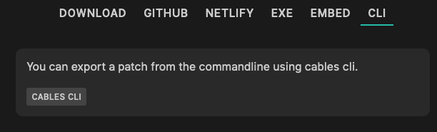

# Export using the cables command line interface

Select the "CLI" option in the export dialog:

You will find a link to [cables-cli](https://github.com/cables-gl/cables-cli) which allows you to use the export form
any node/npm project or the commandline of your operating system.

## Prerequisites

- any current version of node/npm
- an api-key created on [your settings page](https://cables.gl/settings)