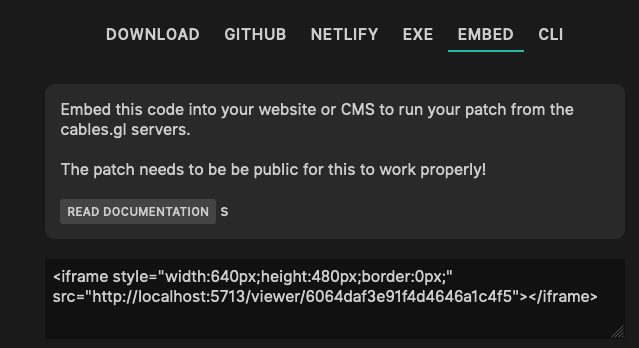

# Export via Iframe

Select the "EMBED" option in the export dialog:

Just copy the code in the textarea to any webpage or CMS you are using. This will run the patch
in an iframe accessing the cables servers everytime it is loaded. 

This means that whenever your change anything in your patch (or we change something in cables) that version will be displayed.

The easiest option for most CMSs, but not the best one if you are still working on the patch or
want your export/integration be as "futureproof" as possible.

## Prerequisites

- any website/cms you can put HTML code into