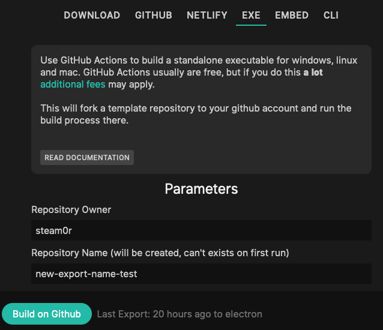

# Export creating a standalone executable

Select the "EXE" option in the export dialog:

This export option allows you to create a standalone executable that will run on windows, linux and mac
natively.

We are using [electron](https://www.electronjs.org/) for the cross-platform running of cables patches and
we will build the executables on our servers for you to download once ready.

The "Windows (webDemoExe)" option is using [webDemoExe](https://github.com/pandrr/WebDemoExe/) to use your local browser (Edge)
and hence has a massively reduced filesize. Check the linked documentation on how and when to use.

Building executables for OSX is not that easy, so there is a few things to keep in mind (see CAVEATS).

## Parameters

Exports can be done by all collaborators added to the patch.

### Architecture

Pick any of the available operating systems and cpu architectures you want your export to run on. Please
take a look at the CAVEATS below if you are trying to export to OS X and especially OS X on ARM ("Apple Silicon"/"M1").

## WALKTHROUGH
- enter the above information
- click on button
- wait for the download button to appear
- download executable, can take some time as electron might turn out to be quite big depending on your platform, even with smaller patches

## CAVEATS MAC OS
- Apple introduced some security features that make it next to impossible to build these kind of apps at the moment, so there is a few caveats when using this on MacOS.
- The executable is not signed, you will need to whitelist it on every machine you run it on (right click, "open" usually does that).
  - We cannot sign this executable, as it's contents do change when downloading a patch, this is intended...sorry...
  - The build for arm/m1-architecture is even harder to run, apple forbids running unsigned apps that are build for arm entirely, not even whitelisting is possible...you may sign it on your own, though.
- Once you downloaded the app, USE THE FINDER to move it basically anywhere else (like your desktop) before opening it
  - Apple puts downloaded apps into a random read-only directory UNTIL YOU MOVE IT USING FINDER, we need to write to the directory...sorry...
- There are ways to make the executable/app work on your mac: [on this website](https://appuals.com/damaged-app-cannot-be-opened-on-macos-error/) . We had success using the command line snippet: `sudo xattr -cr appName.app`

## Export Options

You can choose how the contents of your export should look, the defaults should be fine for almost everything.

### Include assets

If your patch uses uploaded files (textures, audio, data, ...) choose one of the following options to have
these files included in the export.

**Use "All" if you are generating filenames on the fly (iterators, arrays, ...) to make sure all files are available in the Export**

- Automatic: Tries to guess which files are used in the patch and includes only used assets.
- All: Includes all the assets uploaded to the patch or referenced in there, this is the safe option.
- None: Does not include any assets in the export, smaller download but some things might not work in the export

### Package

- Single Javascript File: packages and minifies everything into one single javascript file to include
- Multiple Files: will keep the patch configuration, your code, and core code in seperate files

### Skip Backups

- When deselecting this option, the export will include JSON-files for all the versions of your patch that can be re-imported into cables later.

### Export without subdirectories

- Should you need the directory structure of your patch to be "flat" (no js/ or assets/ subdirectory) you can select this option.
  - This will ususally not be needed, some platforms do not allow for accessing subdirectories tough, and some setups of frameworks like react/vue also behave weirdly with subdirectories.

