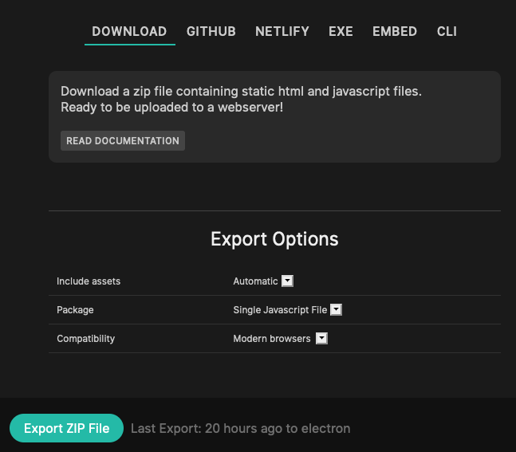

# Export a ZIP file

Select the "DOWNLOAD" option in the export dialog:

If you just want to download your patch and put it on any webserver that you can upload files to, this
is your best option.

The resulting zip-file will include an example index.html to make integration easier, putting all of this
on a webserver should give you a running patch in no time.

## Video Tutorial
<iframe width="384" height="216" src="https://www.youtube.com/embed/B4M9FddXk1I" title=".Zip Export - Byte Size" frameborder="0" allow="accelerometer; autoplay; clipboard-write; encrypted-media; gyroscope; picture-in-picture" allowfullscreen></iframe>

## Export Options

You can choose how the contents of your export should look, the defaults should be fine for almost everything.

### Include assets

If your patch uses uploaded files (textures, audio, data, ...) choose one of the following options to have
these files included in the export.

**Use "All" if you are generating filenames on the fly (iterators, arrays, ...) to make sure all files are available in the Export**

- Automatic: Tries to guess which files are used in the patch and includes only used assets.
- All: Includes all the assets uploaded to the patch or referenced in there, this is the safe option.
- None: Does not include any assets in the export, smaller download but some things might not work in the export

### Package

- Single Javascript File: packages and minifies everything into one single javascript file to include
- Multiple Files: will keep the patch configuration, your code, and core code in seperate files

### Skip Backups

- When deselecting this option, the export will include JSON-files for all the versions of your patch that can be re-imported into cables later.

### Export without subdirectories

- Should you need the directory structure of your patch to be "flat" (no js/ or assets/ subdirectory) you can select this option.
    - This will ususally not be needed, some platforms do not allow for accessing subdirectories tough, and some setups of frameworks like react/vue also behave weirdly with subdirectories.

### Minify Code

- Deselecting this option will make your code bigger, but more readable, might be useful in debugging situations, you usually don't want this in "production".

### Add Source Maps

- When minifying code, this option will add [source maps](https://developer.chrome.com/blog/sourcemaps) to your javascript files.
  This will make the code readable in dev-tools and may help in debugging situations, but will have and additional download for
  people opening the dev-tools of their browser.

## Minify GLSL

- Minify shadercode. Same as "Minify Code", but for GLSL-Shadercode
