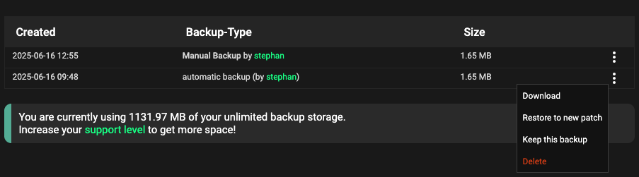
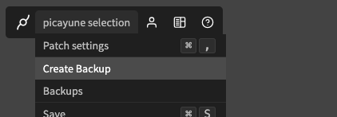
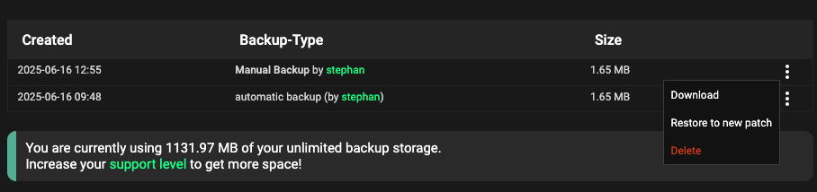

# Backups

If you [support cables](/support) as a patreon, all the membership levels come with some backup space on our machines. Cables will then also
periodically backup the current version of your patch and give you the option to restore this version to a new patch.

## Backups

Exporting and importing patches can be used as a simple way to create backups of different versions of a patch. The format of cables
backups is exactly the same as the ["Patch" export option](../dev_embed/export_standalone/export_standalone). Any export of that type can be treated as a backup of the patch.

Backups thus contain all assets of the patch, used or unused, all ["custom ops"](../../5_1_permissions/3_ops/ops) and all
the subpatchops **at the time of creation of the backup**.

### Automatic Backups

Cables will create automatic backups for you as long as you are not out of backup space, depending on your [supporter level](/support).

Automatic backups **ARE** created:

- before every export
- on loading of the patch
  - if there was a save after the last backup
  - **AND** the last backup is older than 30 minutes

Automatic backups are **NOT** created:

- if you exceeded your storage space limit
- the patch contains no ops

To not automatically push you over your storage limit, **all automatic backups are rolling backups**.
There will be no more than 20 automatic backup versions per patch. Cables will delete the oldest backup of that patch when creating the 20th
backup. We will **never** automatically delete any manually created backups!

To prevent any automatically created backup from deletion, you can "Keep this backup" in the list of backups:

**All backups, manual and automatic, are deleted when you delete the patch!**

### Manual Backups

To create a manual backup of your patch, all the ops and all the assets, click on "Create Backup" in the editor.
Depending on your [supporter level](/support) you will be guided to the [patch export page](../dev_embed/export_standalone/export_standalone)
or be able to give your backup a name. 

Creating a backup will add it to the list of backups available from the "Backup" navigation point
in the editor and can be restored (or downloaded) from there as well:

### Restoring / Managing Backups

To restore a backup that you downloaded, you can simply [import the backup](../import/import) to create a new patch. For any automatic or manual
backups created on cables.gl you can select "Restore to new patch" from the list of backups. Doing this will create a new
patch with the same rules applied when [importing](../import/import).

You can manage the backups of all your patches via ["My Data"](/mydata#backups) from the cables.gl menu. This page will give you an overview
of your currently used storage space, your current limits and let you delete/clean up backups that are not needed anymore...
freeing up space for more.

