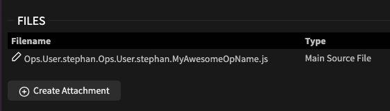

# Using Op Attachments

Attachments are files that can be created and read as a string in the Op they are attached to.
They can contain any kind of data that your op might need for working. Attachments are a good
way to separate data from your opcode, add [WebWorkers](https://developer.mozilla.org/en-US/docs/Web/API/Web_Workers_API) 
or even work with [WASM](https://developer.mozilla.org/en-US/docs/WebAssembly) files.

## Add Attachment

An attachment file can be created by clicking on an Op and then clicking the create button



You then need to give your attachment a name that will later be used to access it's content in your Op.
An attachment named `my_attachment` will be accessible in the Op via `attachments["my_attachment"]`

## Editing Attachment

After you created the attachment, the cables-editor will open and let you edit it's content.

You can open the editor again later by clicking the edit button


## Using attachments

The attachment can now be accessed inside of your op, select the op and press 'e' to enter edit mode.

This snippet will output the contents of your attachment (e.g. "hello attachment"):
```javascript
console.log(attachments["my_attachment"]);
```

### WebWorkers
[WebWorkers](https://developer.mozilla.org/en-US/docs/Web/API/Web_Workers_API) usually reside in separate files from
their main code to run in different threads. You can use attachments, create specially crafted urls from the content
and load these workers to use in ops.

Check this example of a simple echo-service using WebWorkers:

Create an attachment named "worker", with this content:
```javascript
onmessage = function (event) {
  console.log('Received message from main thread:', event.data);
  // Send the result back to the main thread
  postMessage(event.data);
};
```

Edit the Op code to call the worker:
```javascript
// read the contents of the attachment into
const blob = new Blob([attachments["worker"]], {type: 'application/javascript'});
const workerUrl = URL.createObjectURL(blob)

// create worker using your code/url
var worker = new Worker(workerUrl);
worker.postMessage("ECHO");

worker.onmessage = function (event) {
  console.log('Received message from worker:', event.data);
};
```

Running this op (by saving the code), will print this in the dev-console, showing the working echo-service:
```
Received message from main thread: Hello from the main thread!
Received message from worker: Hello from the main thread!
```

### WASM

You can use attachments to work with [WebAssembly](https://developer.mozilla.org/en-US/docs/WebAssembly) modules in your cables Ops.

We will create an op, following the example from [MSDN](https://developer.mozilla.org/en-US/docs/WebAssembly/Guides/Using_the_JavaScript_API)
by encoding their `simple.wasm` file to Base64 and storing that into an attachment called "wasm":

```base64
AGFzbQEAAAABCAJgAX8AYAAAAh4BDG15X25hbWVzcGFjZQ1pbXBvcnRlZF9mdW5jAAADAgEBBxEBDWV4cG9ydGVkX2Z1bmMAAQoIAQYAQSoQAAs=
```

Now, in the Op code, add this:
```javascript
// create data url from base64 wasm code
const ammoWasm = "data:application/wasm;base64," + attachments.wasm;

// define callable functions
const importObject = {
    "my_namespace": { "imported_func": (arg) => { return console.log(arg); } },
};

// fetch code from dataurl and instantiate wasm
fetch(ammoWasm).then((g) =>
{
    WebAssembly.instantiateStreaming(g, importObject).then(
        (obj) =>
        {
            // call wasm-function
            obj.instance.exports.exported_func();
        }
    );
});
```
As stated in the example:

"The net result of this is that we call our exported WebAssembly function exported_func, which in turn calls our imported JavaScript function imported_func, which logs the value provided inside the WebAssembly instance (42) to the console."
