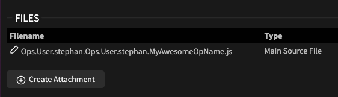
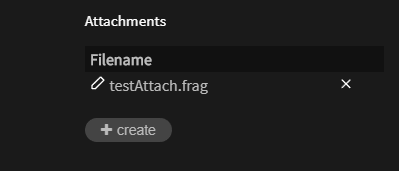

# Using Op Attachments

Attachments are files that can be created and read as a string in the Op they are attached to.
They can contain any kind of data that your op might need for working. Attachments are a good
way to separate data from your opcode e.g. add [WebWorkers](https://developer.mozilla.org/en-US/docs/Web/API/Web_Workers_API).

## Add Attachment

An attachment file can be created by clicking on an Op and then clicking the create button



You then need to give your attachment a name that will later be used to access its content in your Op.
An attachment named `my_attachment` will be accessible in the Op via `attachments["my_attachment"]`

**Hint:** All dots (`.`) in the name entered will be converted to underscores (`_`), so `myattachment.js` will be `attachments["myattachment_js"]`!

## Editing Attachment

After you created the attachment, the cables-editor will open and let you edit its content.

You can open the editor again later by clicking the edit button



## Using attachments

The attachment can now be accessed inside of your op, select the op and press 'e' to enter edit mode.

This snippet will output the contents of your attachment (e.g. "hello attachment"):

```javascript
console.log(attachments["my_attachment"]);
```

### Using "Include JS"

The contents of the attachment will be included (and executed) before your op code. This can be useful to stucture your code,
branch things out into classes or just to have less "boilerplate" code visible in the op editor.

Given an attachment named `context.js` with the following code:

```javascript
class MyOpContext {
  getRandomNumber() {
    return Math.random();
  }
}
```

And an op with the code:

```javascript
const context = new MyOpContext();
console.log("this is in the op:", context.getRandomNumber());
```

Your console will output something like:

```
this is in the op: 0.5711111111111111
```

### WebWorkers

[WebWorkers](https://developer.mozilla.org/en-US/docs/Web/API/Web_Workers_API) usually reside in separate files from
their main code to run in different threads. You can use attachments, create specially crafted urls from the content
and load these workers to use in ops.

Check this example of a simple echo-service using WebWorkers:

Create an attachment named "worker", with this content:

```javascript
onmessage = function (event) {
  console.log("Received message from main thread:", event.data);
  // Send the result back to the main thread
  postMessage(event.data);
};
```

Edit the Op code to call the worker:

```javascript
// read the contents of the attachment into
const blob = new Blob([attachments["worker"]], {
  type: "application/javascript",
});
const workerUrl = URL.createObjectURL(blob);

// create worker using your code/url
var worker = new Worker(workerUrl);
worker.postMessage("ECHO");

worker.onmessage = function (event) {
  console.log("Received message from worker:", event.data);
};
```

Running this op (by saving the code), will print this in the dev-console, showing the working echo-service:

```
Received message from main thread: ECHO
Received message from worker: ECHO
```

### Static Attachment / WASM

Files of type "Static Attachment" will be base64 encoded and added to the op in the variable `staticAttachments`. You can get back
the binary representation by calling `const binary = atob(staticAttachments['my_attachment']);`. For performance reasons it's often a good idea to remove
the base64 representation after usage/conversion by calling `delete staticAttachments['my_attachment']`;

You can use a "Static Attachment" to work with [WebAssembly](https://developer.mozilla.org/en-US/docs/WebAssembly) modules in your cables Ops.

We will create an op, following the example from [MSDN](https://developer.mozilla.org/en-US/docs/WebAssembly/Guides/Using_the_JavaScript_API)
by uploading their `simple.wasm` and making the base64 encoded content available in the op as `staticAttachments.simple_wasm`:

Download [simple.wasm](https://raw.githubusercontent.com/mdn/webassembly-examples/master/js-api-examples/simple.wasm), upload it
as a dependency (as described above) and pick "Static Attachment" as a type.

Now, in the Op code, add this:

```javascript
// create data url from base64 wasm code, make sure the mime-type is "application/wasm"
const simpleWasm =
  "data:application/wasm;base64," + staticAttachments.simple_wasm;

// define callable functions
const importObject = {
  my_namespace: {
    imported_func: (arg) => {
      return console.log(arg);
    },
  },
};

// fetch code from dataurl and instantiate wasm
fetch(simpleWasm).then((g) => {
  WebAssembly.instantiateStreaming(g, importObject).then((obj) => {
    // call wasm-function
    obj.instance.exports.exported_func();

    // free up memory after usage of attachment
    delete staticAttachments["simple_wasm"];
  });
});
```

As stated in the example:

"The net result of this is that we call our exported WebAssembly function exported_func, which in turn calls our imported JavaScript function imported_func, which logs the value provided inside the WebAssembly instance (42) to the console."

#### WASM in libraries / best practices

- Every library does the loading of WASM differently,
- some libraries implement something like "locateFile" or "wasm" in their init process, this usually takes a dataurl and does the fetch part above for you
- See [Ops.Gl.GLTF.GltfDracoCompression](https://cables.gl/op/Ops.Gl.GLTF.GltfDracoCompression_v2) for usage of WASM without using fetch (create Uint8Array from base64, and use additional wrapper)
- See [Ops.Gl.GLTF.KtxCompression](https://cables.gl/op/Ops.Gl.GLTF.KtxCompression_v2) for usage for another way to feed WASM to a library (convert base64 back to binary)
- Check your library documentation and sourcecode on how it expects wasm to be loaded/defined
