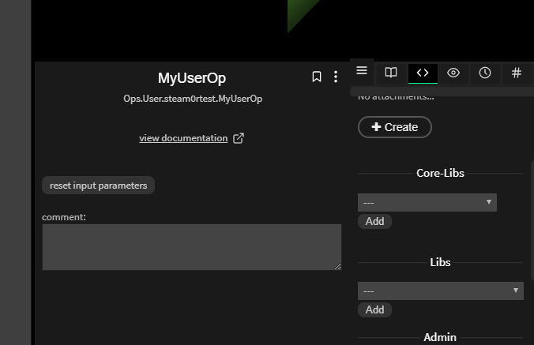

# Libraries

#### How can I use external libraries in cables?

- There is a variety of external libraries available in cables. Once you created your [own OP](https://dev.cables.gl/docs/5_writing_ops/dev_hello_op/dev_hello_op) you find
the selection of libraries from the "code" menu on the right side of the editor, when the op is selected. Select any available
libraries, save and reload the patch and you can use them in your ops.

#### How do I get "libXYZ.js" into cables (add new libraries)?

- If the library is not in the list above, drop us a mail or talk to us on discord, we are usually very open to make more
libraries available in cables. Sometimes there may be licencing issued (preferrably pick libraries that have been put unter
MIT-Licence) or we already have the functionality in cables. So this is a bit of a vested process.
