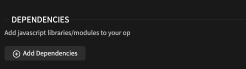
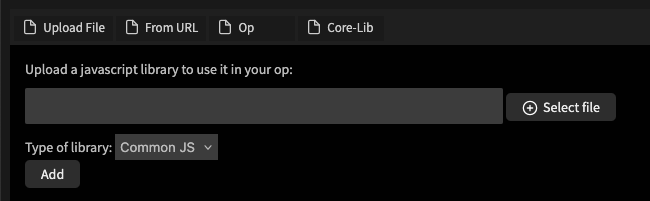
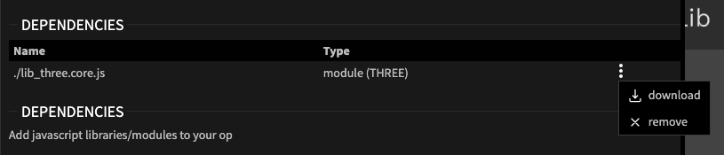

# Libraries

## How can I use external libraries in cables?

You can add external libraries to your [own ops](https://dev.cables.gl/docs/5_writing_ops/dev_hello_op/dev_hello_op). 
These can be either uploaded to cables.gl, or be loaded from an external source (be aware of [CORS-Issues](../../4_export_embed/cors)).

Add them to the Op via "Manage Op" and then "Add Dependencies". From there you have several options to load a library for your op:

### Upload File

This option let's you upload any javascript file to your Op and use it as a library. Any code that is in the file
will be loaded by cables and be included in any export. Libraries are loaded *before* the Op is executed.

Pick a type for your library. If unsure, read on [below](#librarytypes). You can now use all the new functionality in your Op.

### From URL

Pick any library from any source, your own server or a CDN (e.g. [jsDelivr](https://www.jsdelivr.com/) or [cdnjs](https://cdnjs.com/))
and start using the functionality in your Op. 

Pick a type for your library. If unsure, read on [below](#librarytypes).

This is a great way to quickly test libraries in cables, there is a few caveats though:

* If the library is no longer available at the given URL, your Op will no longer work.
* Sometimes you will run into [CORS-Issues](../../4_export_embed/cors) that might not be fixable by you, if you do not control the "other side".
* The loading of your patch will now need access to the internet, even in exports.

### From Npm (Standalone only)

In the [standalone version](https://cables.gl/standalone) of cables you can add [npm packages](https://www.npmjs.com/) via this tab. 
Simply enter the name of the package (as you  would do when running `npm install`) and cables will try to install and load the npm.

Be aware that the [NPM ecosystem](https://www.npmjs.com/) is shared between browsers and "backend systems" ([nodejs](https://nodejs.org/)) 
and some packages cannot  be used by cables, at all. Other packages might be architecture dependent and will not work on all operating systems.
You will have to consult the documentation of the module to find this kind of information.

### Op

Enter a name of any Op to load it's libraries when using your Op. This is useful when you are creating a collection of
Ops that all need to load the same library but you don't want to add it to every individual op.

All libraries are loaded globally and all Ops have access to the global variables provided. This function just
makes sure that you do not need a "LoadMyLibraryOp" before using other ops in your collection. These references to
ops will fail if/once the op is deleted and they will also not automatically update to a newer version, if available.

### Core-Lib

Core-Libs are specific functions of the cables core that went into single modules, small libraries. Since we do not
want to load a lot of code that is not needed for every patch, some ops use these libraries to enhance their functionality
with features from cables core (lights, shadows and physics are some examples). 

Pick any core-lib from the list to give your Op the additional functionality.

## Managing dependencies

Once you added a library to an op you can start using it right away. The list of dependencies will show options
to delete or download any custom library added.

## Library types

By picking the type of the library ("Common JS" or "JS Module") you tell cables how your library needs to be
loaded (sadly you need to know this before, cables cannot guess this from the sourcecode).

By picking "Common JS" your library will be loaded via adding `<script src="mysuperlib.js"/>` to the DOM and
letting the browser decide what to do. This will add your library to the global scope then. You will the be able
to use that variable of the library in your Op (e.g. [handlebars](https://handlebarsjs.com/) adds `Handlebars` to the global scope for you to use).

If you pick "JS Module" you will be able to define the name of the imported variable, your library will be loaded
by calling `import * as YourName from "mysuperlib.js"` and you will then be able to use `YourName` in your Op.

#### How to best-guess the library type?

* Check the documentation of the library, especially the examples on how to import the lib
* * if it says something like `<script src="mylib.js">` it is most likely "Common JS"
* * if it says something like `import MyLib from "mylib.js"` you have a "JS Module"
* Check the sourcecode
* * search for `module.exports` or `require`, if this is present you will most likely have a "Common JS" library
* * if you find something like `class` or `export const` or `export default`, you have a "JS Module"
* Simply try both, you will see errors in the console that might indicate the type of your library
* * `export declarations may only appear at top level of a module` means you loaded a "JS Module" but have your type as "Common Js"
* * loading a "Common JS" as a "JS Module" might work, but will not have the right contents in your `YourLib` variable and fail when using it

