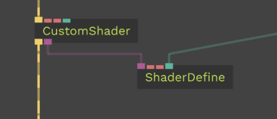

# Writing Shaders

In the following section, we are going to take an in-depth look at how to write (and modify) shaders in cables. To properly understand this guide, it is recommended that you already have some basic [shader knowledge](http://www.thebookofshaders.com) and are familiar with the basic [GLSL](https://www.khronos.org/opengl/wiki/Core_Language_(GLSL)) syntax. Also, you can create a patch with a [CustomShader](https://cables.gl/op/Ops.Gl.Shader.CustomShader_v2) to follow along with this tutorial, as we shall explain the ins and outs of authoring shaders in cables with this op.

## Preqrequisites

To get started, let's have a look at the CustomShader op's vertex and fragment shader source code:

```glsl
// VERTEX SHADER

/* module injection point */
{{MODULES_HEAD}}

/* layout qualifiers */
IN vec3 vPosition;
IN vec2 attrTexCoord;
IN vec3 attrVertNormal;
IN vec3 attrTangent,attrBiTangent;
IN float attrVertIndex;

OUT vec2 texCoord;
OUT vec3 norm;

UNI mat4 projMatrix;
UNI mat4 viewMatrix;
UNI mat4 modelMatrix;

void main()
{
    /* predefined variables */
    texCoord=attrTexCoord;
    norm=attrVertNormal;
    vec4 pos=vec4(vPosition,  1.0);
    vec3 tangent = attrTangent;
    vec3 bitangent = attrBiTangent;
    mat4 mMatrix=modelMatrix;

    /* module injection point */
    {{MODULE_VERTEX_POSITION}}

    /* output */
    gl_Position = projMatrix * (viewMatrix*mMatrix) * pos;
}
```

```glsl
// FRAGMENT SHADER

/* layout qualifiers */
IN vec2 texCoord;

/* module injection point */
{{MODULES_HEAD}}

void main()
{

    /* predefined variables */
    vec4 col=vec4(0.5,0.5,0.5,1.0);

    /* module injection point */
    {{MODULE_COLOR}}

    /* predefined variables */
    outColor = col;
}
```

As you can see, there is quite a bit of default code present. The important parts of the source code have been prefixed with a comment describing what they are. They shall be explained in more detail in the following chapters:

### Layout Qualifiers

```glsl
/* layout qualifiers */
IN vec3 vPosition;
// ...
OUT vec2 texCoord;
// ...
UNI mat4 projMatrix;
```

For better compatibility between WebGL 1.x and 2.x, or GLSL v1 and v3, cables uses predefined [layout qualifiers](https://www.khronos.org/opengl/wiki/Layout_Qualifier_(GLSL)).

What does that mean in layman's terms?

GLSL 3.0 for example uses the qualifier `out` to declare varying data (data that gets passed from vertex to fragment shader), whereas GLSL 1.0 uses the `varying` qualifier to denote the exact same thing.

To counter these differences in syntax when shaders are compiled, cables uses its own layout qualifiers for these types of attributes: `IN`, `OUT` and `UNI`.

The correct qualifiers get injected at compile-time depending on which WebGL version is used in the patch. Thus it is possible to write one shader for both WebGL versions. You can of course still use the original qualifiers, but your shader might not work in both WebGL versions. Please see the following tables for all availible layout qualifiers in cables:

------

#### Vertex Shader Layout Qualifiers

| GLSL 1.0    | GLSL 3.0  | cables |
| ----------- | --------- | ------ |
| `varying`   | `out`     | `OUT`  |
| `attribute` | `in`      | `IN`   |
| `uniform`   | `uniform` | `UNI`  |

#### Fragment Shader Layout Qualifiers

| GLSL 1.0  | GLSL 3.0  | cables |
| --------- | --------- | ------ |
| `varying` | `in`      | `IN`   |
| `uniform` | `uniform` | `UNI`  |

------

## Predefined shader variables

```glsl
IN vec3 vPosition;
IN vec2 attrTexCoord;
IN vec3 attrVertNormal;
IN vec3 attrTangent,attrBiTangent;
IN float attrVertIndex;

OUT vec2 texCoord;
OUT vec3 norm;

UNI mat4 projMatrix;
UNI mat4 viewMatrix;
UNI mat4 modelMatrix;
UNI mat4 inverseViewMatrix;

void main()
{
    texCoord=attrTexCoord;
    norm=attrVertNormal;
    vec4 pos=vec4(vPosition,  1.0);
    mat4 mMatrix=modelMatrix;
    // ....
}
```

To keep consistency along the many shader ops cables includes, there are variables that are named the same throughout the shaders. These include [vertex attributes](https://webglfundamentals.org/webgl/lessons/webgl-attributes.html) and the [core matrices used to render a 3d scene](https://developer.mozilla.org/en-US/docs/Web/API/WebGL_API/WebGL_model_view_projection), but also predefined names for variables passed from vertex to fragment shader.

### Default vertex attributes

The following attributes are passed to the vertex shader from every renderable mesh:
| Data Type | Name  | Function |
| ----------- | --------- | ------ |
| `vec3`| `vPosition`| vertex position in object space|
| `vec2` | `attrTexCoord` | texture coordinates per vertex|
| `vec3`| `attrVertNormal` | normal per vertex|
| `vec3`| `attrVertTangent` | tangent per vertex|
| `vec3`| `attrVertBiTangent` | bitangent per vertex|
| `float`| `attrVertIndex` | [index of the vertex](https://subscription.packtpub.com/book/game_development/9781849691727/2/ch02lvl1sec21/vertices-and-indices)|

### Core matrices

The [following matrices](http://www.opengl-tutorial.org/beginners-tutorials/tutorial-3-matrices/#the-model-view-and-projection-matrices) are passed as uniforms to every shader:
| Data Type | Name  | Function |
| ----------- | --------- | ------ |
| `mat4`| `modelMatrix`|the model matrix|
| `mat4` | `viewMatrix`| the view matrix|
| `mat4`| `projMatrix` |the projection matrix|
| `mat4`| `mvMatrix` |premultiplied model-view matrix|
| `mat4`| `inverseViewMatrix` |the inverted view matrix|

### Default variables

For shaders to be able to consume cables' shader modules correctly, certain variables need to be declared in the `main()` function before the module injection points. If you diverge from the naming, some modules could not work correctly. Also, if you want your shader to work with all modules, you need to declare all of the predefined variables, even if you are not actively using them in your code.

#### Vertex Shader

| Data Type | Name  | Function |
| ----------- | --------- | ------ |
| `mat4`| `mMatrix`|the model matrix|
| `vec4` | `pos`| the vertex' current position. NOTE: this is a `vec4` and not a `vec3` like the variable `vPos`. Make sure you do not forget to cast.|
| `vec3`| `norm` |the vertex normal. This is usually declared as an `OUT` variable. Still it needs to be declared and assigned before module injection.|
| `vec3`| `tangent` |the vertex' tangent|
| `vec3`| `bitangent` |the vertex' bitangent|

#### Fragment Shader

| Data Type | Name  | Function |
| ----------- | --------- | ------ |
| `vec4`| `col`|the color of the current fragment before module injection. |

These variables are used for things like [instancing](https://cables.gl/op/Ops.Gl.MeshInstancer_v4) and [displacement](https://cables.gl/op/Ops.Gl.ShaderEffects.VertexDisplacementMap_v4) or [color manipulation](https://cables.gl/op/Ops.Gl.ShaderEffects.ColorArea_v3).

### Default varying variables

The following vectors are used as varying variables.

| Data Type | Name  | Function |
| ----------- | --------- | ------ |
| `vec2`| `texCoord`|the current vertex texture coordinate|
| `vec3` | `norm`| the current normal|

### Default output variables

#### Vertex Shader

| Data Type | Name  | Function |
| ----------- | --------- | ------ |
| `vec4`| `gl_Position`| GLSL's default vertex shader output variable |

#### Fragment Shader

| Data Type | Name  | Function |
| ----------- | --------- | ------ |
| `vec4`| `outColor`|drop in replacement for `gl_FragColor`. |

### Preprocessor Directives

Cables allows the following [preprocessor directives](https://www.khronos.org/opengl/wiki/Core_Language_(GLSL)#Preprocessor_directives) to be used in your shaders:

| Directive Name | Function |
| -----------| ------ |
|`#define`| Defines static variables |
|`#ifdef {name}` | Defines a conditional branch of shader code |
|`#ifndef {name}` | Defines a conditional branch of shader code (negated) |
|`#endif` | Defines a conditional branch of shader code (negated) |

#### Example for preprocessor directives

Let's take the default CustomShader's fragment shader code and add preprocessor directives to it:

```glsl

#define PI 3.14159265
#define TAU (2.0*PI)

IN vec2 texCoord;

{{MODULES_HEAD}}

void main()
{
    vec4 col=vec4(0.5,0.5,0.5,1.0);

    #ifdef COLOR_BLUE
        col = vec4(0.,0.,1.,1.);
    #endif

    {{MODULE_COLOR}}

    #ifndef COLOR_BLUE
        col = col / PI;
        col.a = 1.;
    #endif

    outColor = col;
}

```

So what does this contrived example do?

First off, we define the constants `PI` and `TAU`.
We can now use them in our shader code, they get replaced by their defined values as soon as the shader is compiled.

Then, we add conditional branching in our shader. If the define `COLOR_BLUE` is defined, we change the variable `col` to blue. If the conditional directive is not defined, we divide the current color `col` by `PI`.

#### How to control defines from the outside

When using the CustomShader op, defines do not get added automatically. You have to take your shader's output and extend it with a [ShaderDefine op](https://cables.gl/op/Ops.Gl.Shader.ShaderDefine). You have to use one ShaderDefine op per define.



Have a look at [this example](https://cables.gl/edit/608697847d06c44673222f57) to see defines in action.

#### Default defines

Cables features a few default defines that get added to **every** shader on compilation:

##### Both Shaders

| Define Directive |  Function |
| ----------- | --------- |
| `#define WEBGL2`| Active when WebGL2 is used |
| `#define texture2D texture`| This ensures cross-compatibility between WebGL1 and WebGL2 shaders. WebGL1 uses `texture(texture, coordinate)` to lookup a pixel in a texture, whereas in WebGL2 you need to use `texture2D(texture, coordinate)` to access a texture. To overcome this language difference, every shader in cables defines a synonym for the `texture2D` function called `texture`|
| `#define UNI uniform`| This ensures cross-compatibility for uniforms between WebGL1 and iWebGL2|
| `#define IN in`| This ensures cross-compatibility for vertex attributes and varying variables between WebGL1 and WebGL2.|


##### Vertex Shader

| Define Directive |  Function |
| ----------- | --------- |
| `#define OUT out`| This ensures cross-compatibility for varying variables between WebGL1 and WebGL2.|


##### Fragment Shader

| Define Directive |  Function |
| ----------- | --------- |
| `#define gl_FragColor outColor`| This ensures cross-compatibility for the color output of fragment shaders between WebGL1 and WebGL2.|

### Module injection points

```glsl
// VERTEX SHADER

/* module injection point */
{{MODULES_HEAD}}


IN vec3 vPosition;

// ....

UNI mat4 modelMatrix;

void main()
{
    texCoord=attrTexCoord;
    norm=attrVertNormal;

    // ...

    /* module injection point */
    {{MODULE_VERTEX_POSITION}}

    gl_Position = projMatrix * (viewMatrix*mMatrix) * pos;
}
```

```glsl
// FRAGMENT SHADER

IN vec2 texCoord;

/* module injection point */
{{MODULES_HEAD}}

void main()
{

    vec4 col=vec4(0.5,0.5,0.5,1.0);

    /* module injection point */
    {{MODULE_COLOR}}

    outColor = col;
}
```

#### Basics

So, what exactly are modules?

Modules are shader extensions that allow you to add additional function to an existing shader (such as a [Material](https://cables.gl/ops/collection/Material)). They can be found in the [ShaderEffects](https://cables.gl/ops/Ops.Gl.ShaderEffects) op section. In easy terms:

Modules or ShaderEffects are shader code snippets that get injected at module injection points and extend the functionality of a shader.

**!! IMPORTANT !!**

**Shader modules rely on default variables and default varying variables. If your shader is missing them, shader effects might not work correctly with your CustomShader. Make sure all default and default varying variables are declared in both shaders, even if you don't use them.**


#### Injection points

The following injection points are availible:

#### Vertex Shader

| Name | Function |
| ----------- | ------ |
| `{{MODULES_HEAD}}`| Here, the shader effect vertex shader's layout qualifiers (`UNI`, `IN` and `OUT`) get injected. |
| `{{MODULES_VERTEX_POSITION}}`| Here, the actual vertex shader code of the shader effect gets injected. |

#### Fragment Shader

| Name | Function |
| ----------- | ------ |
| `{{MODULES_HEAD}}`| Here, the shader effect fragment shader's layout qualifiers (`UNI` and `IN`) get injected. |
| `{{MODULE_COLOR}}`| Here, the actual fragment shader code of the shader effect gets injected. |

#### Example

Let's take the default [CustomShader](https://cables.gl/op/Ops.Gl.Shader.CustomShader_v2) and extend it with a [FresnelGlow](https://cables.gl/op/Ops.Gl.ShaderEffects.FresnelGlow). For simplicity, we will just inspect the vertex shaders' code with a [ShaderInfo](https://cables.gl/op/Ops.Gl.Shader.ShaderInfo).

First off, here is the default CustomShader's vertex shader code again:

```glsl
// CustomShader no module

{{MODULES_HEAD}}
IN vec3 vPosition;
IN vec2 attrTexCoord;
IN vec3 attrVertNormal;
IN vec3 attrTangent,attrBiTangent;
IN float attrVertIndex;
OUT vec2 texCoord;
OUT vec3 norm;
UNI mat4 projMatrix;
UNI mat4 viewMatrix;
UNI mat4 modelMatrix;
void main()
{
    texCoord=attrTexCoord;
    norm=attrVertNormal;
    vec4 pos=vec4(vPosition,  1.0);
    vec3 tangent=attrTangent;
    vec3 bitangent=attrBiTangent;
    mat4 mMatrix=modelMatrix;
    {{MODULE_VERTEX_POSITION}}
    gl_Position = projMatrix * (viewMatrix*mMatrix) * pos;
}
```

The FresnelGlow's shader code is split into two chunks: `fresnel_head.vert` and `fresnel_body.vert`. Let's have a look:

```glsl
// FresnelGlow head shader
#ifdef ENABLE_FRESNEL_MOD
    OUT vec4 MOD_cameraSpace_pos;
    OUT mat3 MOD_viewMatrix;
    OUT vec3 MOD_norm;
#endif
```

```glsl
// FresnelGlow body shader
#ifdef ENABLE_FRESNEL_MOD
    MOD_cameraSpace_pos = viewMatrix*mMatrix * pos;
    MOD_norm = norm;
    MOD_viewMatrix = mat3(viewMatrix);
#endif
```

As you can see, in the head file we declare all relevant qualifiers. In the body some calculations are taking place. What you might notice is the `MOD_`-prefix of the variables. This ensures that the shader variables will always be unique, no matter how many mods you attach to a shader.
Now what happens when we extend our CustomShader?

```glsl
// final extended shader
#version 300 es
//
// vertex shader shaderMaterial copy
//
precision highp float;

#define WEBGL2
#define texture2D texture
#define UNI uniform
#define IN in
#define OUT out

// active mods: ---------------
// 0.0. fresnelGlow (MODULE_VERTEX_POSITION)

// cgl generated
#define ENABLE_FRESNEL_MOD

// cgl generated
UNI vec4 mod12_inFresnel; // mod: fresnelGlow
UNI float mod12_inFresnelExponent; // mod: fresnelGlow

// --


//---- MOD: group:12: idx:1 - prfx:mod12_ - fresnelGlow ------
#ifdef ENABLE_FRESNEL_MOD
    OUT vec4 mod12_cameraSpace_pos;
    OUT mat3 mod12_viewMatrix;
    OUT vec3 mod12_norm;
#endif
//---- end mod ------

//---- MOD: group:12: idx:0 - prfx:mod12_ - fresnelGlow ------

//---- end mod ------

IN vec3 vPosition;
IN vec2 attrTexCoord;
IN vec3 attrVertNormal;
IN vec3 attrTangent,attrBiTangent;
IN float attrVertIndex;
OUT vec2 texCoord;
OUT vec3 norm;
UNI mat4 projMatrix;
UNI mat4 viewMatrix;
UNI mat4 modelMatrix;
void main()
{
    texCoord=attrTexCoord;
    norm=attrVertNormal;
    vec4 pos=vec4(vPosition,  1.0);
    vec3 tangent=attrTangent;
    vec3 bitangent=attrBiTangent;
    mat4 mMatrix=modelMatrix;


//---- MOD: fresnelGlow ------
#ifdef ENABLE_FRESNEL_MOD
    mod12_cameraSpace_pos = viewMatrix*mMatrix * pos;
    mod12_norm = norm;
    mod12_viewMatrix = mat3(viewMatrix);
#endif
//---- end mod ------

    gl_Position = projMatrix * (viewMatrix*mMatrix) * pos;
}
```

So, there are a few things to notice here. First off: The module injection points `{{{MODULES_HEAD}}}` and `{{{MODULE_VERTEX_POSITION}}}` are no longer there. They have been replaced with the following segments:

```glsl
// MODULES_HEAD


// active mods: ---------------
// 0.0. fresnelGlow (MODULE_VERTEX_POSITION)

// cgl generated
#define ENABLE_FRESNEL_MOD

// cgl generated
UNI vec4 mod12_inFresnel; // mod: fresnelGlow
UNI float mod12_inFresnelExponent; // mod: fresnelGlow

// --


//---- MOD: group:12: idx:1 - prfx:mod12_ - fresnelGlow ------
#ifdef ENABLE_FRESNEL_MOD
    OUT vec4 mod12_cameraSpace_pos;
    OUT mat3 mod12_viewMatrix;
    OUT vec3 mod12_norm;
#endif
//---- end mod ------

//---- MOD: group:12: idx:0 - prfx:mod12_ - fresnelGlow ------
```

```glsl
// MODULE_VERTEX_POSITION

//---- MOD: fresnelGlow ------
#ifdef ENABLE_FRESNEL_MOD
    mod12_cameraSpace_pos = viewMatrix*mMatrix * pos;
    mod12_norm = norm;
    mod12_viewMatrix = mat3(viewMatrix);
#endif
//---- end mod ------
```

The `MOD_`-prefix has been replaced with a `mod12`-prefix. Every shader extension gets their own unique identifier to not clash with other shader extensions. If you use multiple shader effects, every shader extension will get their own `modXX`-prefix.

Have a look at the following [example](https://cables.gl/edit/NPCCdA): Disconnect the FresnelGlow op and look at the vertex shader's code. After that, readd the module and inspect the code again.

## CustomShader op

A little note on the CustomShader op:

As soon as you declare variables as uniforms (such as a `vec3` or a `sampler2D`), the input ports are automatically added to the op.


If you still need help, feel free to [contact us on Discord](https://discord.gg/AGTarWv). We are happy to help! Happy shader coding!
