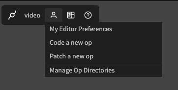
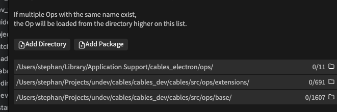

# Coding Ops

Cables standalone comes with [all the ops](https://cables.gl/ops) on cables.gl, all the [extensions](https://cables.gl/ops/Ops.Extension) and a few [special ops](https://cables.gl/ops/Ops.Extension.Standalone) 
that only work when using the standalone version.

You can use cables standalone to [code your own ops](../../5_writing_ops/coding_ops). A few concepts are slightly different
from how things work in the browser and on the web. Here is what's different:

## Op directories

One big difference to how things work on [cables.gl](https://cables.gl) is, that you can have ops from different sources
on your hard disk. You can individually pick different directories, collections of ops and their code per project and
cables will then load the relevant ops for your.

All the ops in the directories are sorted into a hierarchy, should they have the same name, the "topmost" one wins.
This way you can easily override (for example) core-ops with your own implementation, swap out collections of ops
with the ones from your colleagues or try out new operators real quick. 

You can re-order the hierarchy in the "Manage Op Directories"-tab:

## Using an external editor

Every op that you use in a standalone project registers a listener in the file system to listen for changes. If you open
the op's JavaScript file in any external editor you can edit the code and see the changes reflect immediately. To get
to the op's directory quickly, click on the folder-icon in the "Manage Op"-tab.

