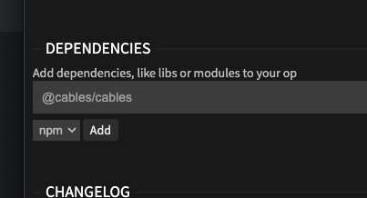
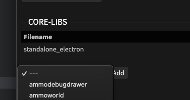

# Using NPM

## What is NPM?

NPM stands for the [node package manager](https://www.npmjs.com/) and is a widely used tool to manage dependencies
of applications developed in JavaScript. It also features access to a vast collection of libraries written in
JavaScript that can (potentially) be used in cables standalone. 

## Why NPM?

Cables standalone in not being bound to the browser-sandbox anymore and has more direct access to features of
the underlying operating system. This makes it possible to you a lot of the packages on [npmjs.com](https://www.npmjs.com/)
in ops. Features like access to the [file system](https://cables.gl/ops/Ops.Extension.Standalone.Files), [network interfaces](https://cables.gl/ops/Ops.Extension.Standalone.Net), or [native binaries](https://cables.gl/op/Ops.Extension.Standalone.Ffmpeg) opens up a 
whole new set of possibilities to work with cables.

## How do I add a library to my Op?

Once you created or cloned your own Op, you can use any npm package by adding it on the "Manage Op"-Tab. Enter its
name as it appears on npmjs.org. So e.g. `npm install osc-js` becomes `osc-js`, if you want to add a fixed version to your
package add it to the name, like this `osc-js@2.4.1`.



The wanted package will be installed into the [op's directory](../2_sharing_ops/sharing_ops) into a `node_modules` folder.
This folder should not be shared or added to any repositories, as it might contain operating-system dependent code (and
also is usually pretty big...).

Afterward, add the `standalone_electron` core-lib to the Op. This will make sure that people that end up using this
on cables.gl will get a warning that this Op might not work on the web.



### I am getting errors like `require() of ES Module` or `failed to load node module`

This likely means that the library/module you are trying to use is either:

- not packaged to be used in electron/browser
- uses native modules that need to be precompiled

You can try working around this by putting the precompiled/packaged node_modules folder into the [op-dir](../2_sharing_ops/sharing_ops) on your own,
but these ops won't be [sharable](../2_sharing_ops/sharing_ops).

### How do I use a library in any of my ops?

After you added the library to your op (say you used the `osc-js`-package from above) you can use `op.require` to load the
library. Here are a few examples from the documentation pages of different libraries and how they translate to cables:

#### require:
```js
const OSC = require('osc-js')
```
will become:
```js
const OSC = op.require("osc-js");
```
---
#### default import:
```js
import path from 'path';
```
will become:
```js
const path = op.require("path");
```
---
#### named import:
```js
import { HfInference } from '@huggingface/inference';
```
will become:
```js
const hf = op.require("@huggingface/inference");
const HfInference = hf.HfInference;
```

## Does cables standalone come with built-in libraries?

Cables standalone comes with (at least) the native [nodejs libraries](https://github.com/nodejs/node/tree/v20.13.1/lib) of the node
version that was used to build it, this (currently) includes modules like `os`, `fs`, `path`, `http`, `net` and more...

You can use these modules without adding them to the dependencies section in "Manage Op":

```js
const OSC = op.require("os");
const ifaces = os.networkInterfaces();
```
