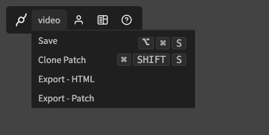

# Import/Export

## Export patch from cables.gl to standalone

Any patch that is exported using the "patch" export option has everything needed (ops, assets, ...) to be opened
in the standalone version. Make sure to have a [recent version](https://cables.gl/standalone) of cables standalone to make sure all the core
ops are up-to-date.

## Export patch from standalone (to cables.gl)

To export a patch that you worked on in cables standalone and put it on a web server, select "Export - HTML" from the
navigation. This will create a ZIP-File that is similar to the [HTML-Export](../../4_export_embed/dev_embed/export_zip/export_zip) on cables.gl

The "Export - Patch" option will give you a zip-file containing an export that is similar to the ["Patch"](../../4_export_embed/dev_embed/export_standalone/export_standalone) export option
on cables.gl and can be imported back to cables.gl using the [ZIP-Upload](https://cables.gl/mydata#import) in "My Data".

If you do not want to import to cables.gl but want to collect all your assets next to your patch-file (the `.cables` one),
in the standalone version, press `cmd + p` or `ctrl + p` to open up the command palette and execute these two commands:

