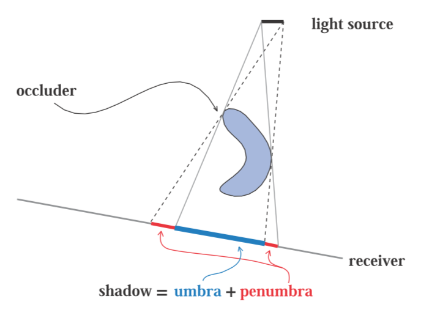
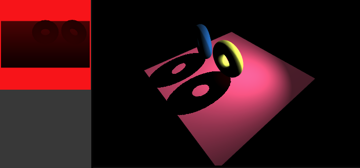
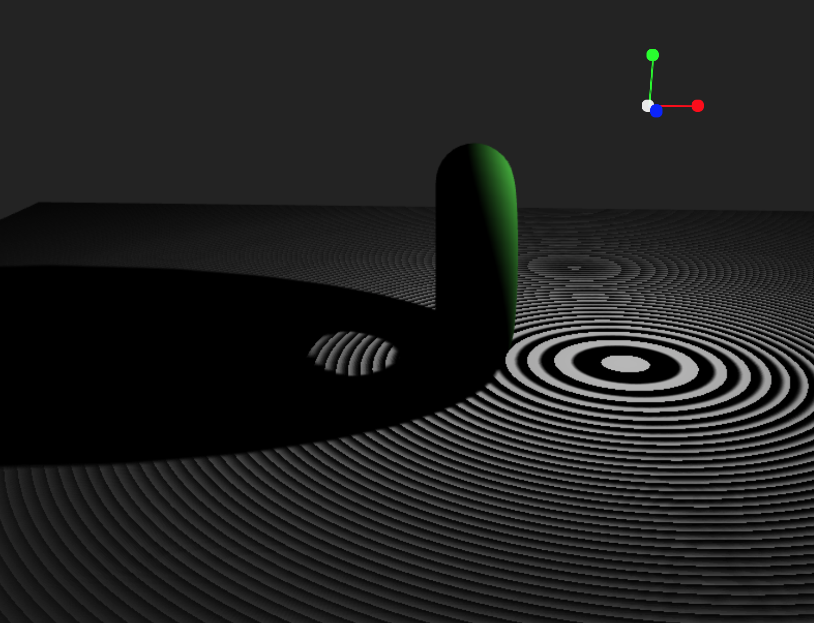

# Shadows

Since the July 2020 Cables update, it is possible to add shadows to any material. In this section of the documentation, we will explore how the system works and how to use it efficiently. We will also look into common problems that can occur with adding shadows to a scene. Please keep in mind that the operators are subject to change in the future. We will try to keep the documentation as up to date as possible but if you find outdated parts or explanations that don't hold true anymore, do not hesitate to [contact us on Discord](https://discord.gg/AGTarWv).

## Introduction

<!-- <iframe width="640" height="360"  src="https://sandbox.cables.gl/viewer/5f2a82e5565f4e7e4d42ff15" frameborder="0"></iframe> -->
Please refer to the [basic example](https://cables.gl/p/p-Pnre) to see the most basic setup for enabling shadows.

The following ops are able to cast shadows:

- [Point Light](https://cables.gl/op/Ops.Gl.Phong.PointLight_v5)
- [Directional Light](https://cables.gl/op/Ops.Gl.Phong.DirectionalLight_v5)
- [Spot Light](https://cables.gl/op/Ops.Gl.Phong.SpotLight_v5)

The following op(s) allow to receive shadows:

- [Shadow](https://cables.gl/op/Ops.Gl.ShaderEffects.Shadow_v2)

in conjuction with any [Material](https://cables.gl/ops/collection/Material).

Before we dive into creating shadows, we need to cover the basic terminology first:

## Theoretical Overview

There are 3 entities at work when talking about shadows: the light source, the occluder and the receiver.

The *light source* emits light. The *occluder* is an object that *casts* a shadow onto a *receiver*. A receiver *receives* the shadow cast by the occluder.
Shadows are achieved through the occluder blocking the light from the light source that is supposed to reach the receiver, therefore coloring the part of the receiver that is occluded darker than the rest.

The shadow that is being cast can be split in two zones:
the *umbra*, the hard part of the shadow, and the *penumbra*, the soft part at the edge of the shadow.

When we talk about *soft shadows*, we mean shadows that feature a soft penumbra. When we talk about *hard shadows*, the shadows do **not** display a penumbra.

Cables' shadow system is based on the principle of [shadow mapping](https://en.wikipedia.org/wiki/Shadow_mapping).

How shadow mapping works in a nutshell:

We render the scene we want to shadow from the light's perspective into a texture where we store the distance of the scene's objects to the camera. We compare the distances stored in this texture to the distance of the scene's objects to our scene's camera. Pixels that are closer to the light than to our scene's camera will be shadowed.

Okay, enough with the theory, let's dive into creating shadows!

## Basic Setup

In the screenshot above you see the minimum amount of operators needed to get shadows on the screen. [The patch for the screenshot is availible here](https://cables.gl/p/J4R3_e).

You can add multiple [Shadow](https://cables.gl/op/Ops.Gl.ShaderEffects.Shadow_v2) before meshes to enable or disable shadow casting.

Check out [this patch](https://cables.gl/p/Iqob_e), an extension of our minimal example that features 3 toruses, the middle one not casting a shadow.

## Multiple Lights

All lights except our [Ambient Light](https://cables.gl/op/Ops.Gl.Phong.AmbientLight_v4) operator are able to cast shadows. You are able to preview the shadow map when you click on a light operator and the property `Cast Shadow` is activated.

It is possible that multiple lights cast shadows.

Whenever you are using multiple lights in a scene, make sure to tame parameters like `Intensity` to get a more natural look.

[The patch for this screenshot is availible here](https://cables.gl/p/5f2aad23565f4e7e4d42ff23).

### Shadow Map Settings

It is important to get the light's camera right to achieve good-looking shadows. Take a look at the following screenshot:

Here we can see the shadow map settings for [Directional Light](https://cables.gl/op/Ops.Gl.Phong.DirectionalLight_v5). The properties `LR-BottomTop`, `Near`, and `Far` are responsible for setting up the camera. These properties define the shadow camera's view frustum. Here are some good guidelines while setting these up:

1. Make sure the camera captures the scene and the scene only. Anything that does not cast a shadow or is empty space should not be seen by the camera. This ensures that we have as little jagged stair-case artefacts as possible (More on that in the chapter "Perspective Aliasing").
2. Whenever an object is not visible in the shadow map preview, it will most-likely not cast a shadow.

#### A note on Point and Spot Lights

The camera settings for these 2 lights differ a little bit.

The [Point Light](https://cables.gl/op/Ops.Gl.Phong.PointLight_v5) renders its shadow information into a cubemap instead of a texture. You can only set the `Near` and `Far` values and they will be applied to each side of the cubemap. Currently it is not possible to set different `Near` and `Far` values per side.

The [Spot Light](https://cables.gl/op/Ops.Gl.Phong.SpotLight_v5)'s shadow camera exposes `Near` and `Far` values aswell, but does not expose `LR-Bottom-Top`. Instead, the FOV of the camera is defined by the spot light's `Cone Angle` property.

## Algorithms

The shadow system of cables currently features 4 shadow mapping algorithms that can be selected in the [Shadow](https://cables.gl/op/Ops.Gl.ShaderEffects.Shadow_v2) op. They will be briefly introduced in this section:

### Default

The default shadow algorithm is only able to produce hard shadows. This algorithm is the fastest & cheapest and is based on the [1978 algorithm by Williams](http://cseweb.ucsd.edu/~ravir/274/15/papers/p270-williams.pdf).

### PCF (Percentage-Closer-Filtering)

The *PCF*, or *Percentage-Cl oser-Filtering*, algorithm is an extension of the default algorithm. It is able to produce *soft shadows* by linearly interpolating between the pixels of the shadow map. We are able to set the amount of sampling with the parameter `Sample Amount` featured in the [Shadow](https://cables.gl/op/Ops.Gl.ShaderEffects.Shadow_v2) op.
The higher the `Sample Amount`, the more expensive the calculations become. Most of the time, an amount of **4** samples should be enough to soften the shadows' edges.

#### A note on the [Point Light](https://cables.gl/op/Ops.Gl.Phong.PointLight_v5) op:

When using a point light, it is possible to use the `Sample Distribution` parameter to either:

 1) combat *shadow acne* (explained in the section *Common Problems & Artifacts*)
 2) change the appearance of the shadows so that there are "multiple" shadows that overlap each other

With the PCF algorithm, this parameter only works with a point light.

### Poisson

The *Poisson* algorithm (named after the famous french mathematician [Siméon Denis Poisson](https://en.wikipedia.org/wiki/Siméon_Denis_Poisson)) works like the PCF algorithm, with the difference that samples are not taken by linearly interpolating between values, but instead using *random offsets* distributed on a [Poisson Disc](https://medium.com/@hemalatha.psna/implementation-of-poisson-disc-sampling-in-javascript-17665e406ce1).

We are able to set the amount of sampling with the parameter `Sample Amount` featured in the [Shadow](https://cables.gl/op/Ops.Gl.ShaderEffects.Shadow_v2) op. In most cases, taking **4** samples will be enough. The `Sample Distribution` parameter allows us to change the "amount of sample points" used. The higher the value, the denser the sample distribution. Try keeping the value between **250** - **800** for best results.

### VSM (Variance Shadow Mapping)

The *VSM*, or *Variance Shadow Mapping*, algorithm is a more recent one, developed by [Donelly and Lauritzen](https://www.punkuser.net/vsm/vsm_paper.pdf). It uses probability theory behind the scenes to soften shadows.

We are able to soften the shadows by increasing the `Blur Amount` in the [Directional Light](https://cables.gl/op/Ops.Gl.Phong.DirectionalLight_v5) and [Spot Light](https://cables.gl/op/Ops.Gl.Phong.SpotLight_v5) operators.
Blurring point light shadows does **not** work, as there is no way in WebGL (1 and 2). Though VSM looks the best and is relatively cheap compared to Poisson and PCF, it comes with its own caveats; the main one being so called *Light Leaking* (explained in the chapter "Common Problems & Artifacts"). If you experience light leaking, try increasing the `Bias` parameter until leaking disappears. There are more solutions to tackle light leaking, also presented in the chapter "Common Problems & Artifacts".

## Common Problems & Artifacts

In this section, we are going to examine common pitfalls that can happen when using shadow mapping. The different algorithms can produce different artifacts, depending on how they are used. Let's first start with artifacts that can happen with any of the algorithms:

### Shadow acne

Shadow acne can happen with any algorithm. The root for the problem is that the shadow map is always a 2D representation of a 3D scene. The values stored in this 2D representation can sometimes lack accuracy or have "dead spots", where the value over- or undershoots. To solve this problem, there are a few possible solutions:

1. Try increasing the `Bias` property on your light. Usually a bias between `0.001` and `0.1` should do the trick. Try keeping the bias as low as possible as it can make shadows seem unrealistic with higher values.
2. Increase the resolution of the shadow map if the problem still persists after increasing the `Bias`.

A note on the `Bias` property used with the `VSM` (Variance Shadow Mapping) algorithm:

Here the `Bias` is not used to counter shadow acne, but so called `Light Leaking` which will be explained a little further ahead. `VSM` by design eliminates shadow acne, therefor no bias adjustment is needed for shadow acne.

## Peter Panning

Peter Panning basically means that your object appears to be hovering, even though it shouldn't be.

There are 4 solutions to get rid of it:

1. Set the `Near` and `Far` properties of the `Shadow Map Settings` of the casting light so, that:
   1. The `Near`-plane of the shadow camera starts as close to the occluders as possible.
   2. The `Far`-plane of the shadow camera spans **only** the scene and nothing more. Try fitting the camera's viewport as tightly to the scene as possible.
2. Do not use geometries that have no width. If you want to have a floor, lose a very thin cube instead of a rectangle.
3. Compose your scene so it contains as little touching geometries as possible.
4. Use the `Normal Offset` property of the casting light to move the shadow along the normal of the receiving geometry (does not work with PointLight).

Generally speaking, always try to ONLY render what your light actually sees. There is no use in trying to capture the whole scene with the light's shadow camera when the only thing casting shadows is a mesh in the middle of a scene.

## Perspective & Projective Aliasing

### Perspective Aliasing

*Perspective Aliasing* occurs when shadow map resolution is insufficient for the size of the shadow camera's view frustum. In simple terms, *Perspective Aliasing* occurs when your `Near` and `Far` values span a large range and your occluding geometry is far away from the light. This typically happens more often with `SpotLight` rather than `Directional-` or `PointLight` operators.

To get rid of perspective aliasing, you can do the following:

1. readjust your `Near` and `Far` values and your light's `Position`.
2. Increase the `Shadow Map Size` of your light.
3. Make sure your geometry is not too far away from your light.

### Projective Aliasing

*Projective Aliasing* happens when the light's direction & the view direction is (almost) perpendicular to the occluder. This problem does not occur as often and can be fixed by one of the following measurements:

1. Change the angle (position) of your light until the problem disappears.
2. Use the light's `Normal Offset` property to move the shadows a little bit.
3. Try changing the positions of objects in your scene a little bit.

## Light Bleeding (only VSM)

*Light Bleeding*, also called *Light Leaking*, happens with the `VSM`, or *Variance Shadow Mapping*, algorithm only. The problem occurs when multiple occluders cover the same area of a receiver. You can try getting rid of light leaking by increasing the `Bias` property. The more you increase the bias, the less soft your shadows will appear. Be careful when adjusting.

In general it is advised to use VSM with wide scenes or scenes where objects have a bit of distance to each other and don't overlap.

## Advanced

Have a look at [this patch](https://cables.gl/p/M0F2We) and play around with it to see the potential the new shadow system has.

We are very excited to see what you can come up with! Don't be afraid to publish your patches.

## Last notes

If you experience any problems not listed in this documentation, feel free to post on our [forum](https://forum.cables.gl) and let us know if we can help you.
