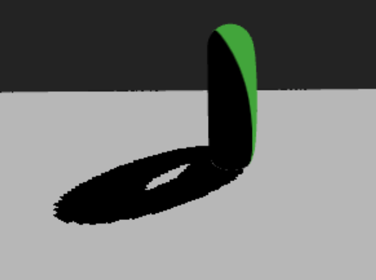
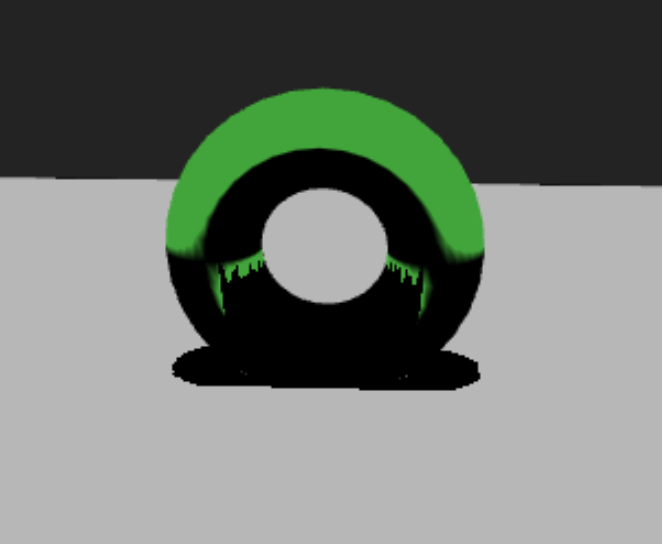
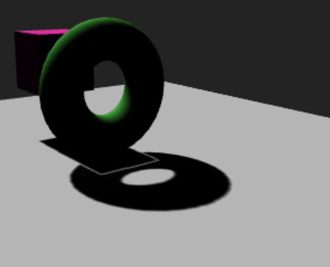

# Shadows

## Basic Setup
Please refer to the [basic example](https://cables.gl/p/p-Pnre) to see the most basic setup for enabling shadows.

The following ops are able to cast shadows:

- [Point Light](https://cables.gl/op/Ops.Gl.Phong.PointLight_v5)
- [Directional Light](https://cables.gl/op/Ops.Gl.Phong.DirectionalLight_v5)
- [Spot Light](https://cables.gl/op/Ops.Gl.Phong.SpotLight_v5)

The following op(s) allow to receive shadows:

- [Shadow](https://cables.gl/op/Ops.Gl.ShaderEffects.Shadow_v2)

in conjuction with any [Material](https://cables.gl/ops/collection/Material).

## Algorithm Overview

TBD

### Default

 TBD

### PCF (Percentage-Closer-Filtering)

### Poisson

### VSM (Variance Shadow Mapping)

## Common Problems & Artifacts

In this section, we are going to examine common pitfalls that can happen when using shadow mapping. The different algorithms can produce different artifacts, depending on how they are used. Let's first start with artifacts that can happen with any of the algorithms:

### Shadow acne

Shadow acne can happen with any algorithm. The root for the problem is that the shadow map is always a 2D representation of a 3D scene. The values stored in this 2D representation can sometimes lack accuracy or have "dead spots", where the value over- or undershoots. To solve this problem, there are a few possible solutions:

1. Try increasing the `Bias` property on your light. Usually a bias between `0.001` and `0.1` should do the trick. Try keeping the bias as low as possible as it can make shadows seem unrealistic with higher values.
2. Increase the resolution of the shadow map if the problem still persists after increasing the `Bias`.

A note on the `Bias` property used with the `VSM` (Variance Shadow Mapping) algorithm:

Here the `Bias` is not used to counter shadow acne, but so called `Light Leaking` which will be explained a little further ahead. `VSM` by design eliminates shadow acne, therefor no bias adjustment is needed for shadow acne.

## Peter Panning

Peter Panning basically means that your object appears to be hovering, even though it shouldn't be.

There are 4 solutions to get rid of it:

1. Set the `Near` and `Far` properties of the `Shadow Map Settings` of the casting light so, that:
   1. The `Near`-plane of the shadow camera starts as far away from its position as possible.
   2. The `Far`-plane of the shadow camera is as close to its position as possible.
2. Do not use geometries that have no width. If you want to have a floor, lose a very thin cube instead of a rectangle.
3. Compose your scene so it contains as little touching geometries as possible.
4. Use the `Normal Offset` property of the casting light to move the shadow along the normal of the receiving geometry (does not work with PointLight).

Generally speaking, always try to ONLY render what your light actually sees. There is no use in trying to capture the whole scene with the light's shadow camera when the only thing casting shadows is a mesh in the middle of a scene.

## Perspective & Projective Aliasing

### Perspective Aliasing

*Perspective Aliasing* occurs when shadow map resolution is insufficient for the size of the shadow camera's view frustum. In simple terms, *Perspective Aliasing* occurs when your `Near` and `Far` values span a large range and your occluding geometry is far away from the light. This typically happens more often with `SpotLight` rather than `Directional-` or `PointLight` operators.

To get rid of perspective aliasing, you can do the following:

1. readjust your `Near` and `Far` values and your light's `Position`.
2. Increase the `Shadow Map Size` of your light.
3. Make sure your geometry is not too far away from your light.

### Projective Aliasing

*Projective Aliasing* happens when the light's direction & the view direction is (almost) perpendicular to the occluder. This problem does not occur as often and can be fixed by one of the following measurements:

1. Change the angle (position) of your light until the problem disappears.
2. Use the light's `Normal Offset` property to move the shadows a little bit.
3. Try changing the positions of objects in your scene a little bit.

## Light Bleeding (only VSM)

*Light Bleeding*, also called *Light Leaking*, happens with the `VSM`, or *Variance Shadow Mapping*, algorithm only. The problem occurs when multiple occluders cover the same area of a receiver. You can try getting rid of light leaking by increasing the `Bias` property. The more you increase the bias, the less soft your shadows will appear. Be careful when adjusting.

In general it is advised to use VSM with wide scenes or scenes where objects have a bit of distance to each other and don't overlap.
