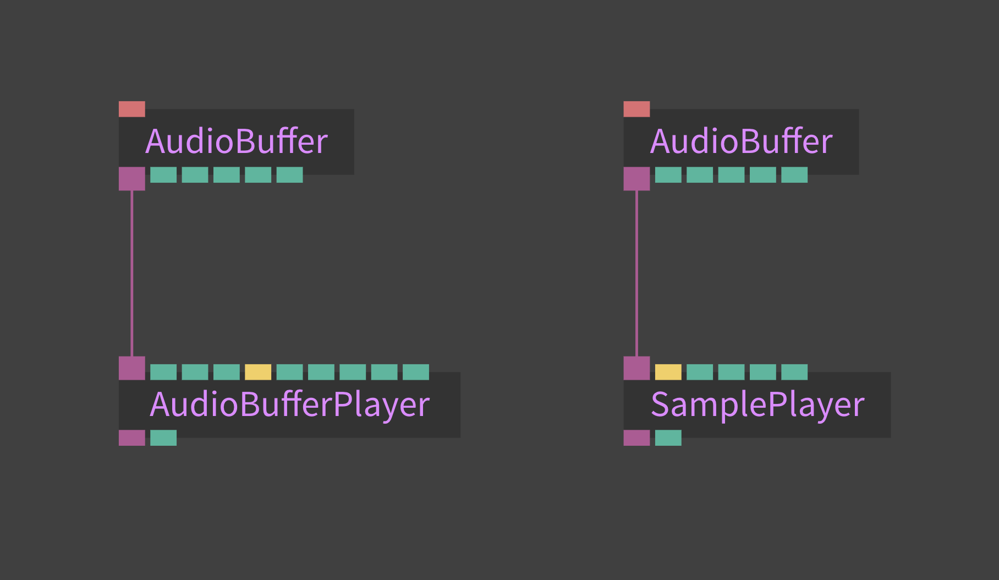
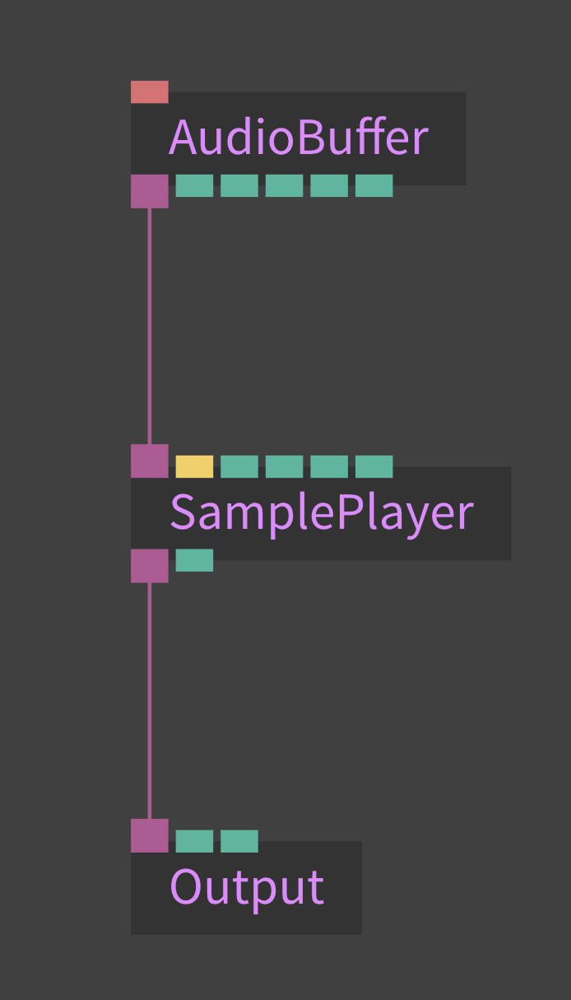
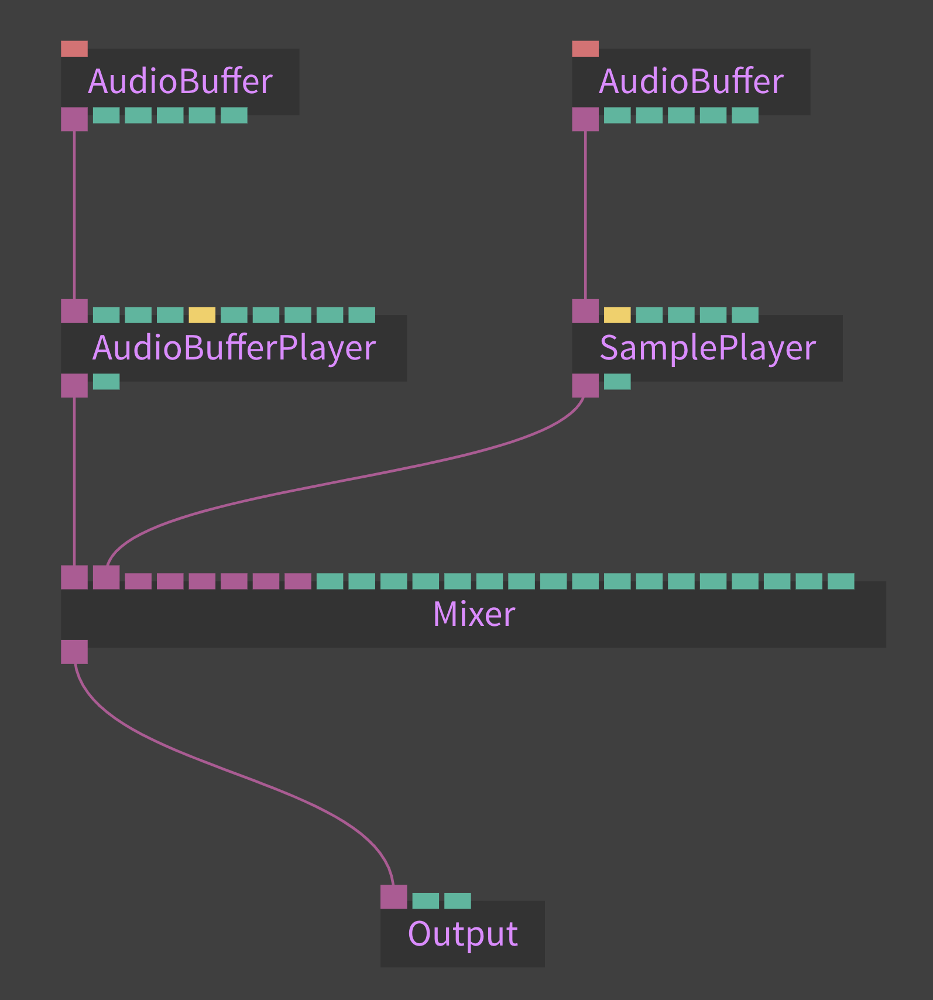
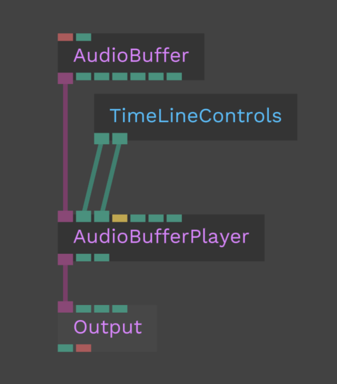

# Basic Audio Setup

To get an audio stream into cables, there are multiple options. First off, to play back any file, you need to use the [Audio Buffer](https://cables.gl/op/Ops.WebAudio.AudioBuffer_v2) op. With this op, you create an audio buffer that you can connect to one of our audio players mentioned in the next section. If you upload a file to cables and drag-drop it on the patch field, an AudioBuffer op will be created.

#### A note on file formats

Depending on your target platform, you need to keep in mind that not all file formats work consistently on all browsers & operating systems. To counteract this, we provide the [BrowserSpecificFile op](https://cables.gl/op/Ops.Html.BrowserSpecificFile_v2) that lets you switch files depending on which browser/OS is detected. In its' documentation, you can find the specific file formats needed for the different browsers. Have a look at the [example patch](https://cables.gl/edit/5f88465bab82411d4f75112e) for usage.

As a little example:
To be able to loop a file in Firefox, the file format needs to be **.ogg**, where as in Chrome, you need an **.mp3**. In Safari, you need an **.m4a** file.

## AudioBufferPlayer vs. SamplePlayer

After you successfully loaded a file into the AudioBuffer op, you need a player to play back the buffer. You have two choices here, depending on what you want to do:

1. If you want to play back a sound as a loop, such as a background ambience or a longer audio file, such as a musical piece, you should use the [AudioBufferPlayer](https://cables.gl/op/Ops.WebAudio.AudioBufferPlayer_v2) op.

2. If you want to play a shorter sound (called one-shot), such as a notification sound, a drum sample or want to play a file based on a trigger, use the [SamplePlayer](https://cables.gl/op/Ops.WebAudio.SamplePlayer) op. A little side note: keep in mind that when triggering multiple times and using longer files, the audio file will play back twice. Make sure you time your triggers correctly to avoid overlapping the sound multiple times. This can lead to distortion, because the sounds add up in volume.

## Getting sound to play back on your speakers

After you have connected the AudioBuffer to one of the two players, connect the player to an [Output op](https://cables.gl/op/Ops.WebAudio.Output_v2). If you press play on your player, you should hear sound coming out of the speakers. If you don't hear sound, make sure to check your system's volume settings and verify your browser tab is not muted.

## Multiple audio inputs

It is not recommended to plug multiple audio streams (such as two SamplePlayers) into one Output op as it can lead to unexpected behaviour.

If you want to connect multiple audio sources, use the [Mixer](https://cables.gl/op/Ops.WebAudio.Mixer) op before your output and connect the two. The Mixer op features volume and pan controls for up to eight channels. If you need more input channels, cascade multiple Mixers.

## Connecting the timeline and audio playback

Timeline can be easily connected with audio playback by using [TimeLinecontrols](https://cables.gl/op/Ops.TimeLine.TimeLineControls).

