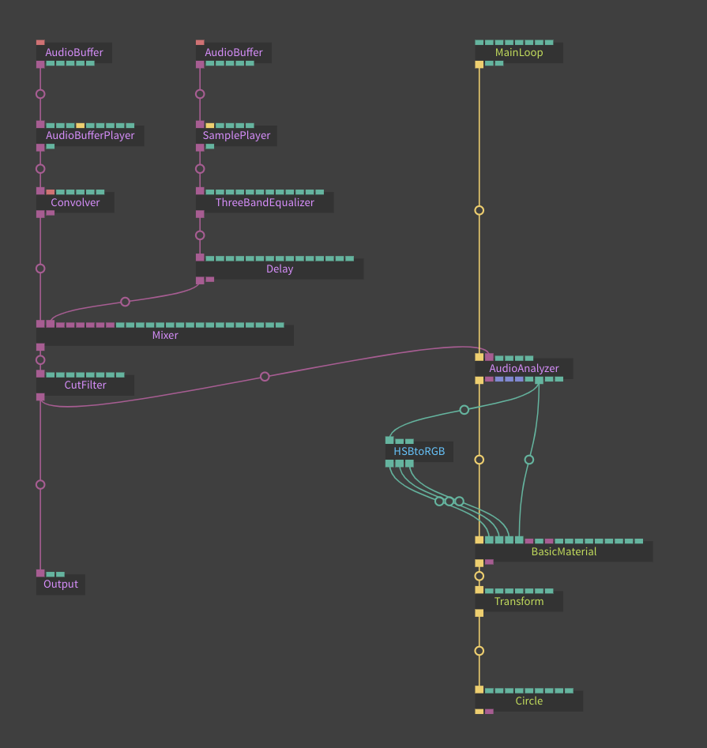

# Real-Time Audio Analyzation & Audio Visualization

To be able to generate visuals driven by sound, you need to extract either the current amplitude or the amplitude of a certain frequency region (say you want to trigger a visual when a kick drum is played; you would only want to consider the bass frequencies of your sound to interact with the visuals).

We offer you three operators to analyze sound and extract various information from them.

The first operator is the [AudioAnalyzer](https://cables.gl/op/Ops.WebAudio.AudioAnalyzer_v2). This op provides you with amplitude outputs and FFT transformed array outputs. Have a look at this [example patch](https://cables.gl/edit/Vm37yp) for a simple overview of the controls. If you want a showcase of its abilities, refer to [this patch](https://cables.gl/edit/55f8367f42eae93b29bf87b9) to see it in action. It's output is also used for the following two operators.

The second op to analyze audio with is the [FFTAreaAverage](https://cables.gl/op/Ops.WebAudio.FFTAreaAverage_v2) op. It needs the FFT Array output of the AudioAnalyzer as an input to work.
This op lets you specify a rectangle in the frequency spectrum of your file. The op will only analyze the corresponding frequency and amplitude range. The width of the rectangle is the frequency range and the height of the rectangle is the amplitude range. Have a look at the [example patch](https://cables.gl/edit/5fd79f607c7e326dfef72449) to get further insights.

The third op is the [AnalyzerTexture](https://cables.gl/op/Ops.WebAudio.AnalyzerTexture_v2) op. It also takes the FFT Array output of the AudioAnalyzer and creates a black and white texture from it. This op is useful for texture masks in postprocessing or sound-dependent altering of visual aspects of objects using materials. Please refer to the [example patch](https://cables.gl/edit/5fd8b4391d3e0022a8736fd7). You could for instance use the texture output as an input to the opacity texture of a [BasicMaterial](https://cables.gl/op/Ops.Gl.Shader.BasicMaterial_v3).

With these three ops, you are able to drive anything responding to sound. If you use audio effects before your analyzation (so that they are not heard), you can manipulate the audio signal in parallel while the original sound is played back. A whole world of new visualization possibilities opens up.

A patch to make a circle change color & opacity could look like this:

