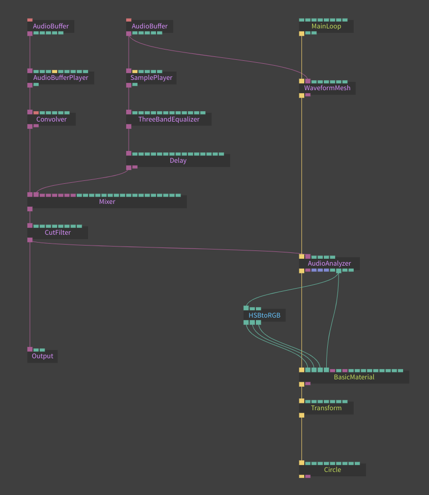

# Offline Audio Visualization & Analyzation

Cables offers two operators to extract visual data from an [AudioBuffer](https://cables.gl/op/Ops.WebAudio.AudioBuffer_v2).

If you want to work with geometries, then you should consider the [WaveformMesh](https://cables.gl/op/Ops.WebAudio.WaveformMesh) operator. This op renders the waveform as a mesh, but you can also disable rendering and use its' geometry output for further geometry manipulation. Have a look at the [example patch](https://cables.gl/edit/5fd8a8911d3e0022a8736f19).

If you want to work with splines or array data points, consider the [AudioBufferToSplineArray](https://cables.gl/op/Ops.WebAudio.AudioBufferToSplineArray) operator. This generates an array of spline points to be used with Spline ops, such as the [SplineMesh](https://cables.gl/op/Ops.Gl.Meshes.SplineMesh_v2) and the [SplineMeshMaterial](https://cables.gl/op/Ops.Gl.Meshes.SplineMeshMaterial_v2) operator. Have a look at the [example patch](https://cables.gl/edit/5fd88d171d3e0022a8736c3a).

Congrats, you have made it through the whole tutorial! A patch to use offline & real time visualization could look like this:

